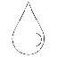
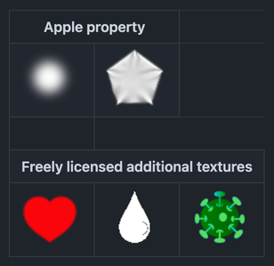

# Purrticles standard textures

The files in here are the textures used in particle emitters by Purrticles. They are small bitmaps that are often scaled and tinted in the emitters.

## Apple™ Standard particle textures
These two image files are property of Apple Incorporated and no rights are asserted.

They are copied here for your convenience to be able to open them and use in Apple's [Xcode][x1] and [Swift Playground app][p1].

All the standard emitter templates used with the Xcode [SpriteKit Particle File][x2] template use the `spark.png` texture image, except for the **Bokeh** sample which uses `bokeh.png`

## Additional texture images
As of Purrticles 1.0.2 there are three other textures bundled in the Purrticles app and used in standard templates.

In future, you will be able to add your own textures - see [issue 15][gh15].

## Image previews 
Github preview won't color backgrounds so best to look at this in a [dark theme][ght].

<table> 
  <tr><th colspan="2">Apple property</th></tr>
  <tr>
    <td>
      
    </td>
    <td>
      
    </td>
  </tr>
  <tr><th>&nbsp;</th></tr>
  <tr><th colspan="3">Freely licensed additional textures</th></tr>
  <tr>
    <td>
      
    </td>
    <td>
      
    </td>
    <td>
      
    </td>
  </tr>
</table>

### Dark mode preview
Screenshot taken in dark mode so you can see the above table with good contrast against the images

[p1]: https://apps.apple.com/au/app/swift-playground/id908519492
[x1]:https://developer.apple.com/xcode/
[x2]: https://developer.apple.com/documentation/xcode/creating-a-spritekit-particle-emitter-in-xcode

[gh15]: https://github.com/Touchgram/purrticles/issues/15
[ght]: https://docs.github.com/en/get-started/accessibility/managing-your-theme-settings
